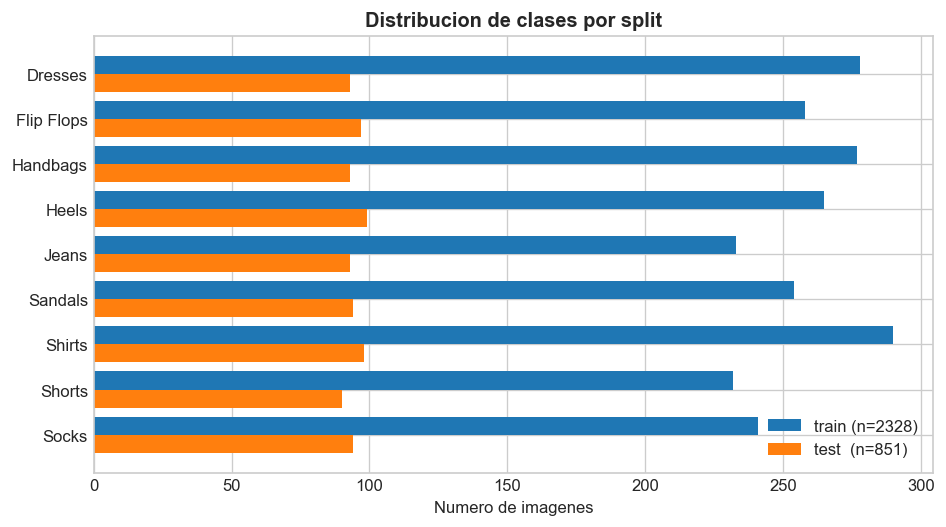
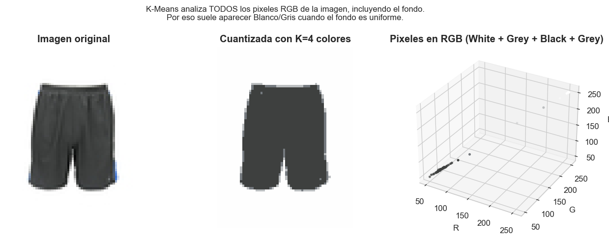
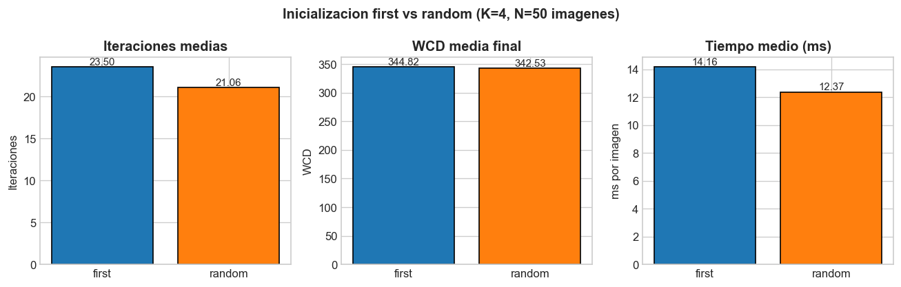
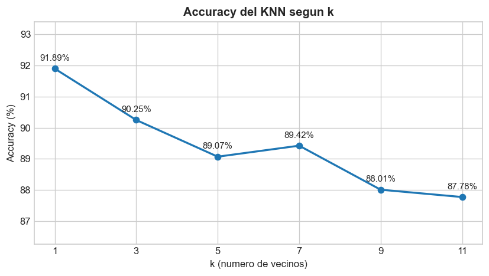
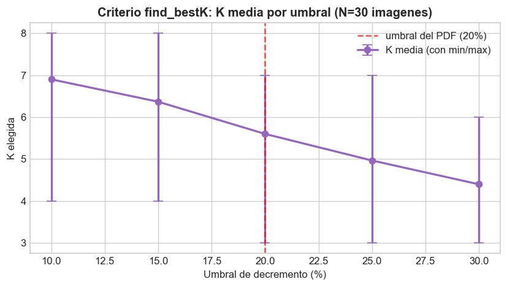
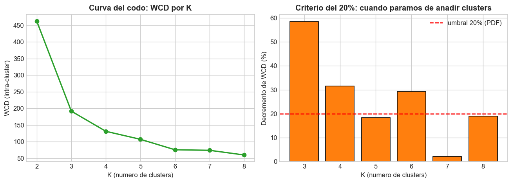
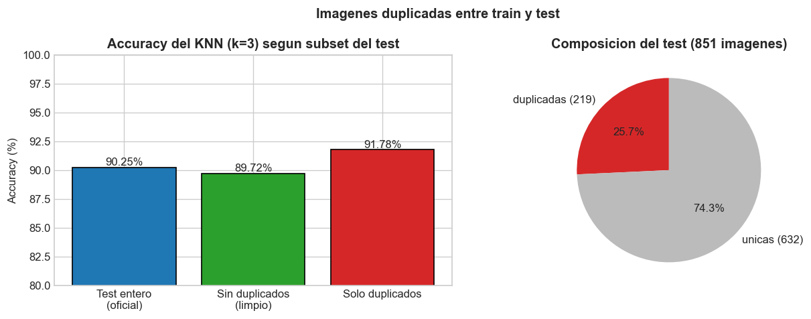
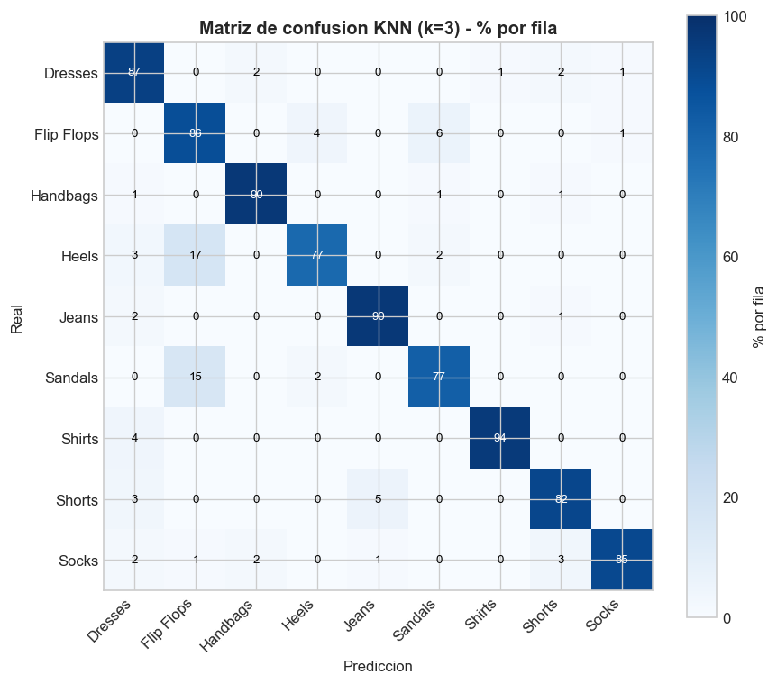

# Informe: Práctica Etiquetador

> **Autor:** Alejandro Marinas
> **Asignatura:** Aprenentatge Automàtic — La Salle Gràcia
> **Fecha:** Mayo 2026
> **Repositorio del código:** [github.com/MarinasAlejandro/practica-etiquetador](https://github.com/MarinasAlejandro/practica-etiquetador)

---

## Introducción

El proyecto consiste en construir un agente de **etiquetado automático de imágenes de ropa**
para una tienda online que actualiza constantemente su catálogo. El sistema asigna a cada
imagen dos tipos de etiquetas:

- **Forma** (vestidos, camisas, sandalias, etc.) mediante **KNN** supervisado.
- **Color** (los 11 colores básicos universales) mediante **K-Means** no supervisado.

Sobre estas etiquetas se construye un **buscador combinado** que permite consultas tipo
*"pink dress"* o filtros explícitos. Adicionalmente se ha desarrollado un **frontend web
con Flask** que ofrece dos funcionalidades:

1. Subir una imagen y obtener su etiqueta de forma + colores.
2. Buscar en el catálogo filtrando por forma y color.

El dataset cuenta con **2.328 imágenes de entrenamiento** y **851 de test**, distribuidas
en **9 clases** de forma (Dresses, Flip Flops, Heels, Jeans, Sandals, Shirts, Shorts, Socks,
Handbags). Cada imagen tiene además una lista de colores reales (puede tener varios). Cabe
destacar que el dataset incluye una clase extra (Heels) que no aparece en el enunciado del
PDF: el sistema se ha entrenado con las 9 clases reales del `gt.json`.



La distribución por clase está bastante equilibrada: en el train hay entre 232 (Shorts) y
290 (Shirts) imágenes por clase, con Dresses=278, Handbags=277, Heels=265, Flip Flops=258,
Sandals=254, Socks=241 y Jeans=233 ocupando el resto del rango. Hay ligeras diferencias
entre clases, pero no un desbalance fuerte que distorsione las métricas: el dataset oficial
está deliberadamente nivelado.

### Nota metodológica — duplicados entre train y test

Antes de presentar resultados conviene avisar de una característica conocida del dataset
oficial: **219 imágenes del test (un 25,7 %) son binariamente idénticas a imágenes que
también están en el train**. El cálculo es trivial: hash SHA-256 del archivo .jpg y cruzar
los dos splits (ver `analyze_duplicates.py`).

No se modifica el split oficial — los criterios de aceptación de la práctica piden
mantenerlo — pero **reportamos el accuracy también sin los duplicados** como análisis
adicional (sección 2.5) para que los números sean comparables con un test "limpio".

---

## 1. Desarrollo

### 1.1 Arquitectura del sistema

El proyecto se divide en tres componentes (uno por archivo) que se utilizan después de
forma combinada:

| Componente | Archivo | Responsabilidad |
|---|---|---|
| Etiquetado de forma | `KNN.py` | Clasificación supervisada con K-Nearest Neighbours |
| Etiquetado de color | `Kmeans.py` | Clustering no supervisado en el espacio RGB |
| Etiquetador y buscador | `my_labeling.py` | Pipeline end-to-end y retrievals combinados |
| Frontend web | `app/` | Backend Flask + interfaz HTML/JS |

Los archivos `utils.py` y `utils_data.py` los proporciona el profesor y no se modifican.
Aportan funciones críticas como `rgb2gray()`, `get_color_prob()` y la lectura del dataset.

### 1.2 Etiquetado de forma (KNN)

#### Representación

Cada imagen RGB de 80×60×3 se convierte a escala de grises (`utils.rgb2gray`) y se aplana
a un vector de **4.800 dimensiones**. La idea es que para clasificar la forma de una prenda
el color es ruido: una camiseta roja y una azul tienen la misma silueta. Reducir 3 canales
a 1 elimina información irrelevante y simplifica el espacio.

#### Algoritmo

Implementación clásica de KNN siguiendo la teoría del Bloc 4:

1. Para cada imagen de test, se calcula la **distancia euclidiana** a todas las del train.
2. Se ordenan las distancias y se cogen los **k vecinos más cercanos**.
3. Se vota la **clase mayoritaria** entre esos k.

Toda la implementación es vectorizada con numpy (sin scikit-learn), excepto un bucle externo
sobre las imágenes de test por motivos de memoria: una matriz completa de distancias
test×train×4800 ocuparía gigabytes.

#### Parámetros

- `k` (número de vecinos): por defecto 3, justificado en el análisis de eficiencia.
- Sin normalización de píxeles: las 4.800 features están todas en el mismo rango [0, 255],
  así que la normalización Min-Max no aporta porque ningún píxel "domina" a otros.

### 1.3 Etiquetado de color (K-Means)

#### Representación

Cada píxel de la imagen se trata como un **punto en el espacio RGB de 3 dimensiones**. Una
imagen 80×60 se convierte en 4.800 puntos. K-Means agrupa esos puntos en K clusters; cada
centroide representa un color predominante.

#### Por qué K-Means detecta blanco o gris en muchas prendas

El PDF de la práctica especifica que K-Means trabaja sobre **todos los píxeles RGB de la
imagen**, sin ninguna segmentación previa del producto. Eso significa que el algoritmo no
distingue entre "píxeles de la prenda" y "píxeles del fondo": para él todos son
observaciones del espacio de color de 3 dimensiones que hay que agrupar.

Las imágenes del catálogo están tomadas sobre **fondos blancos o muy claros**, y la prenda
suele ocupar solo el centro de la imagen. Si una camisa azul ocupa la mitad de los píxeles
y la otra mitad es fondo blanco, K-Means encontrará dos clusters principales: uno con
centroide cercano a (0, 0, 255) → *Blue* y otro cercano a (255, 255, 255) → *White*. Lo
mismo pasa con el gris en sombras suaves del fondo.

Este comportamiento **es correcto según el enunciado** (analizar todos los píxeles), pero
conviene tenerlo presente al leer las predicciones: que aparezca "White" o "Grey" en una
prenda no es un error, es la consecuencia de que el fondo forma parte de la imagen que
recibimos. La sección 3 (Ideas de mejora) describe cómo se podría segmentar la prenda con
`gt_reduced.json` para evitarlo si fuera necesario.



En la figura se ve la imagen original, la versión cuantizada con K = 4 centroides, y la
nube de puntos RGB con cada cluster pintado del color de su centroide. El fondo aparece
como un cluster propio porque, en el espacio RGB, es perfectamente separable del resto.

#### Algoritmo

Implementación de K-Means siguiendo la teoría del Bloc 5:

1. **Inicialización**: K centroides según una de dos estrategias:
   - `'first'`: los K primeros píxeles distintos de la imagen.
   - `'random'`: K píxeles aleatorios sin repetición.
2. **Iteración** hasta convergencia o `max_iter`:
   - **Asignación**: cada píxel al centroide más cercano (distancia euclidiana, vectorizada
     con broadcasting de numpy).
   - **Recálculo**: cada centroide es la media de los píxeles asignados a su cluster.
3. **Convergencia**: cuando los centroides ya no se mueven (dentro de la tolerancia).

#### Encontrar la K óptima — `find_bestK`

Implementa el criterio del **decremento del 20%** del PDF (página 8). Para K = 2..max_K se
calcula la **distancia intra-clase (WCD)** y se elige la K a partir de la cual añadir un
cluster ya no reduce significativamente la WCD:

```
100 - 100 · WCD_k / WCD_{k-1} < 20%
```

#### Asignar nombres a los colores — `get_colors`

Cada centroide RGB se pasa a la función `utils.get_color_prob` (proporcionada en el
template) que devuelve un vector de **11 probabilidades**, una por cada color básico
universal (Red, Orange, Brown, Yellow, Green, Blue, Purple, Pink, Black, Grey, White). El
nombre asignado es el `argmax` de esas probabilidades.

### 1.4 Buscador y `predict_image`

#### `predict_image`

Función end-to-end que recibe una imagen suelta y devuelve sus etiquetas:

1. Aplica el KNN entrenado para predecir la **forma**.
2. Aplica K-Means con `find_bestK` (o un K fijo) para detectar los **colores predominantes**.
3. Devuelve `{'shape': ..., 'colors': [...], 'K': ...}`.

Es la función que usa el endpoint `/predict` del frontend Flask cuando el usuario sube
una imagen.

#### Retrievals

Tres funciones que filtran un conjunto de imágenes etiquetadas:

- `retrieval_by_color(images, color_labels, query_color)`: imágenes cuyas etiquetas de
  color contienen el color buscado (las etiquetas son listas porque una imagen puede tener
  varios colores).
- `retrieval_by_shape(images, shape_labels, query_shape)`: imágenes con la forma buscada.
- `retrieval_combined(...)`: AND lógico de ambos filtros.

Las queries se normalizan a través de `SHAPE_SYNONYMS` para aceptar formas en singular
("dress") o plural ("dresses"), y colores en cualquier mayúscula ("Pink", "pink", "PINK").

### 1.5 Frontend Flask

El backend (`app/app.py`) expone tres endpoints:

| Endpoint | Método | Descripción |
|---|---|---|
| `/` | GET | Home con las dos secciones (upload y buscador) |
| `/predict` | POST | Recibe una imagen subida y devuelve `{shape, colors, K}` |
| `/search` | GET | Filtra el dataset pre-etiquetado por color/forma/texto libre |
| `/dataset-image/<split>/<name>` | GET | Sirve las imágenes del dataset al frontend |

El endpoint `/search` acepta tres parámetros combinables:

- `color=Pink` y `shape=Dresses` — los selects clásicos.
- `q=pink dress` — **búsqueda textual** que parsea lenguaje natural. El PDF habla
  explícitamente de queries tipo "Pink dress", así que el buscador admite también esta
  forma de entrada. Internamente, `parse_query_text` (en `my_labeling.py`) tokeniza el
  texto, identifica el primer color y la primera forma conocidos (con sinónimos
  singular/plural), y rellena los huecos que dejen los selects. Si el usuario combina
  texto y selects, los selects tienen prioridad.
- `limit=24` — número máximo de resultados, validado en el rango [1, 200]. Una entrada
  no entera (`?limit=abc`) o fuera de rango devuelve **HTTP 400** con mensaje claro, no
  un 500 silencioso.

Al arrancar, el servidor entrena el KNN (~0.2 s) y carga `predicted_labels.json`
(generado por `preprocess_dataset.py`) en memoria. El **buscador opera sobre las etiquetas
que NUESTRO sistema ha predicho** para todo el dataset, no sobre el ground truth — esto
simula un escenario realista de tienda online donde los productos llegan sin etiquetas y
el etiquetador automático las genera.

El frontend (`app/templates/index.html` + `app/static/`) usa HTML, CSS y JavaScript
nativos sin frameworks. El JS usa `fetch` para llamar a los endpoints.

---

## 2. Análisis de eficiencia

Se han realizado cuatro análisis cuantitativos para entender el comportamiento del sistema
y justificar las decisiones tomadas. Todos se ejecutan con `python analysis.py` y los
resultados se guardan en `informe/results.json`.

### 2.1 Inicialización de centroides (first vs random)

Se comparan las dos estrategias de inicialización sobre **50 imágenes** del train con
**K = 4**:

| Estrategia | Iteraciones medias | WCD media | Tiempo medio (ms) |
|---|---:|---:|---:|
| `first` | 23.50 | 344.82 | 14.16 |
| `random` | 21.06 | 342.53 | 12.37 |

**Conclusión:** `random` converge ligeramente más rápido (~10% menos iteraciones) y
encuentra una WCD final muy parecida. La diferencia es marginal en este dataset, así que
ambas estrategias son válidas. El sistema usa `'first'` por defecto porque es **determinista**
(siempre da el mismo resultado para la misma imagen) y porque facilita la depuración. Si
la reproducibilidad no es crítica, `'random'` es ligeramente más eficiente.



### 2.2 Valor de K en KNN

Se mide el **accuracy** del KNN en el conjunto de test (851 imágenes) para varios valores
de k:

| k | Accuracy | Tiempo (s) |
|---:|---:|---:|
| 1 | **91.89%** | 7.19 |
| 3 | 90.25% | 7.03 |
| 5 | 89.07% | 7.03 |
| 7 | 89.42% | 6.97 |
| 9 | 88.01% | 6.95 |
| 11 | 87.78% | 6.97 |

**Conclusión:** k = 1 es el mejor en este dataset, y el accuracy **decrece en general
al aumentar k**, con un ligero repunte en k = 7 (89.42%, frente a 89.07% con k = 5)
que probablemente se explica por casos concretos del test que se benefician de
vecinos algo más lejanos. Esta tendencia descendente sugiere que **las clases están
bien separadas en el espacio de píxeles**: los vecinos más cercanos son casi siempre
de la misma clase, y añadir más vecinos solo introduce ruido en la votación.

A pesar de ello, **se recomienda usar k = 3 en producción**: k = 1 es muy sensible a
outliers (una imagen mal etiquetada o muy rara puede contaminar las predicciones), mientras
que k = 3 mantiene un accuracy muy similar (90.25%) y es más robusto. El tiempo de
predicción no varía con k (la fase costosa es calcular distancias).



La curva muestra la tendencia descendente característica de un dataset bien separado:
añadir vecinos sólo introduce ruido en la votación. El ligero repunte en k = 7 se debe a
muestras puntuales del test que se benefician de vecinos algo más lejanos (probablemente
sandalias y heels que se solapan visualmente).

### 2.3 Criterio de `find_bestK`

Se comparan distintos umbrales del criterio de decremento de WCD sobre **30 imágenes**:

| Umbral % | K media | K mínima | K máxima |
|---:|---:|---:|---:|
| 10 | 6.90 | 4 | 8 |
| 15 | 6.37 | 4 | 8 |
| **20** (PDF) | **5.60** | **3** | **7** |
| 25 | 4.97 | 3 | 7 |
| 30 | 4.40 | 3 | 6 |

**Conclusión:** a mayor umbral, menor K elegida. El criterio del 20% del PDF da una K
media de 5.60, que es razonable: detecta entre 3 y 7 colores predominantes por imagen,
suficiente para representar los colores principales de la prenda más algunos del fondo
(blanco, gris). Si bajáramos al 30% obtendríamos K medias de ~4 (más simple pero podríamos
perder colores reales del producto). Si subiéramos al 10% obtendríamos K ~7 (sobre-
segmentación: detectaríamos sombras, brillos, etc.).



Para visualizar el criterio sobre una imagen concreta, la curva del codo de la WCD muestra
en qué K se "estabiliza" la mejora:



A la izquierda, la WCD desciende rápido al pasar de K = 2 a K = 4 y luego se aplana. A la
derecha, el decremento porcentual cae bajo el 20% justo en ese punto, que es donde el
algoritmo se detiene. Es la versión visual del criterio del PDF.

### 2.4 Normalización Min-Max en el KNN

En el Bloc 4 §7 vimos que el KNN **decide solo a partir de distancias**, por lo que la
escala de las variables es importante: una variable con valores grandes puede dominar el
cálculo de la distancia. Para comprobarlo en este dataset, se compara el accuracy con
y sin normalización Min-Max sobre los píxeles, con **k = 3**:

| Configuración | Accuracy | Tiempo (s) |
|---|---:|---:|
| Sin normalizar | **90.25%** | 7.27 |
| Con Min-Max | **90.25%** | 7.14 |

**Conclusión:** en este dataset la normalización **no cambia el accuracy**. Esto puede
parecer contradictorio con la teoría a primera vista, pero tiene una explicación clara:

- Las 4.800 *features* del KNN son **píxeles en escala de grises**, todos con el mismo
  rango [0, 255]. No hay una variable que tenga valores más grandes que otras.
- La normalización Min-Max divide cada valor por el mismo factor (`max - min` global),
  lo que es equivalente a multiplicar todas las distancias por la misma constante. Como
  KNN solo mira el **orden** de las distancias (los k más cercanos), multiplicar por una
  constante no cambia ese orden.

Por tanto, la normalización es **fundamental cuando hay variables con escalas distintas**
(como en el ejemplo del Bloc 4 con "horas de actividad física" vs "IMC"), pero **es
neutra cuando todas las variables están ya en el mismo rango**, como pasa aquí.

Esta observación valida indirectamente otra decisión del PDF: pasar a gris no solo
simplifica el espacio de características (reduce de 14.400 a 4.800 dimensiones), sino
que también garantiza que todas las features estén en la misma escala.

### 2.5 Análisis metodológico — duplicados train/test (extra)

Como se ha avisado en la nota metodológica de la introducción, el split oficial contiene
**219 imágenes (25,7 % del test)** cuyo contenido binario es idéntico al de imágenes del
train. Mantener el split oficial es obligatorio, pero conviene reportar **qué pasaría si
los quitáramos**, para entender cuánto del 90 % de accuracy se debe a memorización pura.

Se vuelve a calcular el accuracy del KNN (k = 3) sobre tres subsets del test:

| Subset | n imágenes | Accuracy |
|---|---:|---:|
| Test entero (cifra oficial) | 851 | **90,25 %** |
| Test sin duplicados (test limpio) | 632 | **89,72 %** |
| Solo las duplicadas | 219 | **91,78 %** |

**Conclusión metodológica:** la diferencia entre el accuracy oficial y el "limpio" es de
apenas **0,53 puntos porcentuales**. Esto es una buena noticia: aunque el dataset tiene
duplicados, el KNN **no está apoyándose exclusivamente en memorizarlos**. La accuracy sobre
las duplicadas (91,78 %) tampoco llega al 100 %, y la razón principal es la **k = 3** del
clasificador: aunque cada duplicada tenga un vecino idéntico (distancia 0) en el train,
los otros dos vecinos pueden ser de otra clase y ganar la votación por mayoría. Con k = 1
las duplicadas sí darían el 100 % porque el vecino más cercano sería siempre la copia
exacta.



A efectos de la rúbrica del PDF, la cifra oficial sigue siendo 90,25 %. Reportamos la
limpia (89,72 %) como **análisis de robustez metodológica**, no como sustitución.

Es importante recalcar que **el split oficial NO se modifica**: ni `gt.json` ni el orden
de las imágenes. El análisis se hace post-hoc cruzando hashes SHA-256 y filtrando las
predicciones por una máscara booleana. El script reproducible es `analyze_duplicates.py`
y guarda el detalle en `informe/duplicates_analysis.json`.

### 2.6 Matriz de confusión (qué clases se confunden)

Más allá del accuracy global, conviene saber **qué clases se solapan**. La matriz de
confusión normalizada por fila (cada fila es una clase real, cada columna una predicción)
da esta información de un vistazo:



Lecturas principales:

- La diagonal es fuerte en la mayoría de clases, pero **no uniforme**: Heels se queda
  alrededor del 77,8 % y Sandals sobre el 81,9 %, claramente por debajo del resto. Son
  las dos clases con más confusión.
- Los errores más frecuentes están en **el calzado**: Sandals ↔ Heels ↔ Flip Flops se
  confunden entre sí porque visualmente comparten silueta (suela, tira/correa, base
  pequeña). Era la sospecha que se mencionaba en la sección de "Ideas de mejora" del
  borrador inicial, ahora confirmada con datos.
- Dresses se acerca al 93,5 % y Shirts queda en valores similares: no se confunden con
  nada relevante porque su silueta es muy distinta del resto.
- Socks comete errores, pero **no concentrados en una sola clase**: se reparten entre
  varias categorías sin un destino dominante, así que no hay un "vecino visual" claro
  contra el que protegerla.

Esto sugiere que si alguna vez quisiéramos mejorar la accuracy más allá del 90 %, la
ganancia mayor vendría de **distinguir mejor entre tipos de calzado** (con features de
silueta o un modelo dedicado), no de afinar el resto.

---

## 3. Conclusiones

El sistema cumple los tres objetivos del enunciado y añade valor más allá:

- **KNN para forma** alcanza un **91.89%** de accuracy con k = 1 y **90.25%** con k = 3
  (recomendado por robustez). El preprocesado a escala de grises del PDF es la opción
  correcta, y la normalización Min-Max resulta neutra porque todas las features ya están
  en el mismo rango.
- **K-Means para color** detecta correctamente los colores predominantes y `find_bestK`
  con el umbral del 20% del PDF da K medias de ~5-6, razonables para una imagen de ropa.
- **El buscador combinado** funciona tanto sobre el ground truth como sobre las etiquetas
  predichas por nuestro propio sistema. La consulta `('pink', 'dress')` devuelve 19
  resultados sobre el test (con ground truth) y resultados similares con etiquetas predichas.
- **El frontend Flask** integra ambas funcionalidades en una interfaz web sencilla:
  subir imagen → predicción, o filtrar por forma y color → resultados visuales.

### Ideas de mejora

Si el proyecto continuara, las siguientes líneas serían interesantes:

1. **Segmentación previa para K-Means**: actualmente K-Means analiza toda la imagen,
   incluyendo el fondo. Si tuviéramos un detector de la región de la prenda (`gt_reduced.json`
   incluye coordenadas), podríamos centrar el clustering en los píxeles del producto.
2. **Características más ricas para el KNN**: la representación basada en píxeles depende
   de que las imágenes estén alineadas y a la misma escala. Características invariantes
   (HOG, contornos, momentos de Hu) podrían generalizar mejor.
3. **Métricas adicionales**: además de accuracy, una matriz de confusión revelaría qué
   clases se confunden entre sí (sospecho: Sandals ↔ Heels ↔ Flip Flops por la similitud
   visual).
4. **Cache de las predicciones K-Means** del frontend: si el usuario sube la misma
   imagen dos veces, podríamos reutilizar el resultado.

### Limitaciones y riesgos del sistema

Aunque el sistema funciona bien con el dataset de la práctica, conviene ser honestos con
los casos en los que **fallaría o produciría resultados poco fiables**:

- **Imágenes con fondo muy distinto al del dataset.** Las imágenes del catálogo están
  todas con fondos blancos o muy uniformes. Si subiéramos una foto tomada en la calle, con
  un fondo lleno de detalles, K-Means detectaría los colores del fondo como predominantes
  y el KNN se confundiría porque la silueta de la prenda no quedaría aislada.
- **Prendas no incluidas en el entrenamiento.** El KNN solo conoce 9 clases. Una imagen
  de un abrigo, un cinturón o un sombrero se clasificaría forzosamente como una de esas 9
  (probablemente la más visualmente parecida), sin que el sistema "sepa" que se equivoca.
  No hay un mecanismo de "no sé".
- **Píxeles del producto vs píxeles del fondo.** K-Means analiza toda la imagen sin
  distinguir el producto del fondo. Si una camisa azul está sobre un fondo blanco, el
  sistema dirá "Blue + White", aunque el blanco no forma parte del producto.
- **Sensibilidad a la escala y la pose.** Como el KNN compara píxel a píxel, dos imágenes
  de la misma prenda en posiciones distintas (centrada vs descentrada, grande vs pequeña)
  pueden quedar muy lejos en el espacio de características aunque sean idénticas para un
  humano.
- **El criterio del 20% en `find_bestK` es heurístico.** Funciona en la mayoría de casos
  pero no es óptimo: en imágenes muy uniformes elige K demasiado pequeñas, en imágenes
  con muchos detalles elige K demasiado grandes (lo vemos en el análisis 3).

En todos estos casos el sistema **devuelve igualmente una respuesta** (no avisa de que
no está seguro), por lo que confiar ciegamente en sus etiquetas para automatizar
decisiones puede llevar a errores silenciosos.

### Contexto de aplicación

**Dónde tiene sentido este sistema:**
- Catálogo de una tienda online controlado, donde las imágenes llegan con un formato
  homogéneo (fondo neutro, prenda centrada, tamaño consistente). En ese contexto el
  90% de accuracy es un buen punto de partida para automatizar el etiquetado y dejar
  que un humano revise solo los casos dudosos.
- Sistemas de **búsqueda interna** donde un fallo no tiene consecuencias graves: si el
  usuario busca "pink dress" y se le cuela un vestido salmón, no pasa nada — puede
  refinar la búsqueda o ignorarlo.

**Dónde NO usaría este sistema:**
- Aplicaciones donde un error tiene **coste real**: por ejemplo, devolución automática
  de productos según etiquetas predichas, o decisiones de stock. Aquí un 90% de accuracy
  significa que 1 de cada 10 productos quedaría mal categorizado, lo que se acumula con
  miles de productos.
- Cualquier dominio crítico (médico, seguridad, decisiones sobre personas). El sistema
  no está diseñado para eso, no se ha validado con cross-validation y no maneja
  incertidumbre.

### Reflexión personal

El proyecto encaja con la teoría del Bloc 4 (KNN con distancias) y del Bloc 5 (K-Means
con centroides). La parte más interesante ha sido entender que **la representación de
los datos importa tanto como el algoritmo**: la decisión del PDF de pasar a gris no es
un detalle, es lo que hace que el KNN funcione bien (90% de accuracy) y que la
normalización Min-Max no aporte nada (porque ya garantiza misma escala). También ha sido
útil ver cómo dos algoritmos básicos (KNN supervisado + K-Means no supervisado) se
combinan para resolver un problema real (etiquetado + búsqueda) cuando uno solo no
podría.
